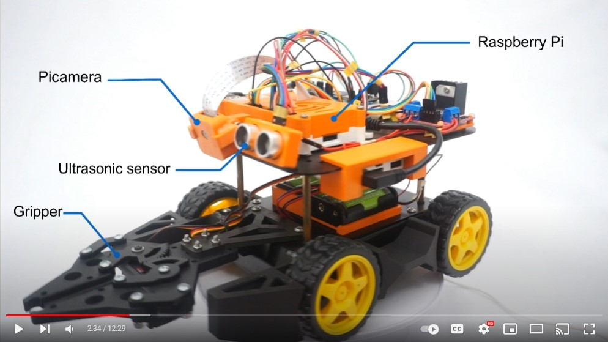

# Autonomous target retrieval and delivery
This is the repository for all the code I developed for the course ENPM809T Autonomous Robot.

In this course I built and programmed an autonomous robot from scratch and the final task (grand challenge) is to autonomously search for and deliver red, green and blue blocks (in this sequence) to a construction zone. 

The motion controls are based IMU, encoder and camera information. The perception relies mainly on the camera images. To determine the block location in relation to the robot, I used corner detection and homography. With the block coordinates, path planning is performed to avoid non-target blocks using A* search algorithm. 

The video attached below details my journey through the course. Be sure to check it out!

The grand_challenge.py is the script used for the final task. It utilizes all other custom implemented Python classes. 

To fully utilize the computation power of the Raspberry Pi, the images from the camera are read using the multithreading package (the camera is accessed using the new Picamera2 package). Similarly, encoder and IMU information is read using the multiprocessing package. 
 
